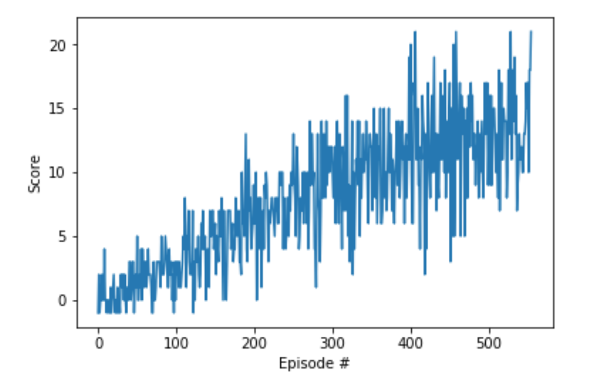

[//]: # (Image References)

[image1]: https://user-images.githubusercontent.com/10624937/42135619-d90f2f28-7d12-11e8-8823-82b970a54d7e.gif "Trained Agent"

# Report Project 1: Navigation

### Neural Network for Agent learning

For this project, it has been used a DQN (Deep Q-network), made of 2 hidden layers. The architecture adopted is the following:

- Input layer: 37
- fully connected layer: units=64
- activation: ReLU
- fully connected layer: units=64
- activation: ReLU
- Output fully connected: 4

It has been used an Adam learning optimizer with a double network (local + target) and Replay Buffer to avoid instability during training.

The hyperparameters have been set as following:

- max episodes=5000
- max steps=1000
- eps start=1.0
- eps end=0.01
- eps decay=0.995

The training has run with these results: 
  
```
Episode 100	Average Score: 1.12
Episode 200	Average Score: 4.88
Episode 300	Average Score: 8.34
Episode 400	Average Score: 10.43
Episode 487	Average Score: 13.03

Environment solved in 387 episodes!	Average Score: 13.03
```

With this progress chart:

<p align="left">
  
</p>


The Agent before training run as in this video:


<p align="left">
  
</p>

After Training, the agent runs as follows:

![Trained Agent][trained]

### Evolution for next releases
  
- Learning from pixels
- Prioritized Experience Replay


